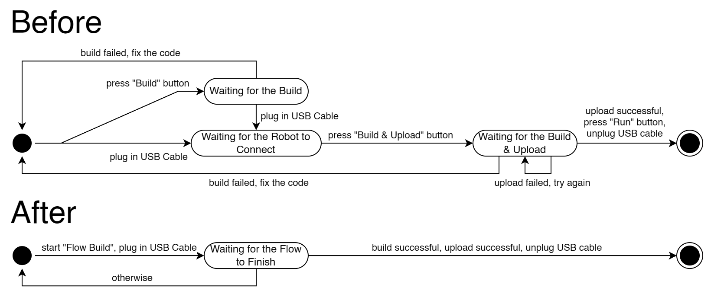

# 4815 Tools

## What does this extension do?

The 4815 Tools VS Code extension provides a set of tools for the 4815 Robotics Team.

It is designed to work with the official [VEX Extension](https://marketplace.visualstudio.com/items?itemName=VEXRobotics.vexcode) to increase the development speed and efficiency of programming VEX V5 and VEX IQ robots in Visual Studio Code.

In addition, it integrates the Git version control system with Bitbucket server as the remote workspace, which allows the team to collaborate on the same project, backup and manage projects more efficiently with just a few clicks.

## Why 4815 Tools?

The 4815 Tools aims to speed up the development process, allowing beginners and advanced users to create, build, upload, and manage projects much more accessible.

### For Build and Upload

4815 Tools is designed for professional teams to speed up their development process exponentially.

On the one hand, with the official extension, the user has to (1) click `Build`, (2) wait for the build to finish, (3) connect the brain to the computer, (4) click `Upload`, (5) wait for the upload to finish, and then (6) disconnect the brain from the computer. This process is very tedious and time-consuming. The user has to focus on the editor and wait for the build and upload to finish.

On the other hand, with 4815 Tools, a new concept called `Flow` is introduced. After the user clicks the `Flow (Build)` button, the project will be built and uploaded to the robot brain when the brain is available. They don't need to connect the brain in order. The user can focus on other things while the project is being built and will be notified when the project is built and uploaded.

The following video demonstrates how the new `Flow` concept works.

https://github.com/4815repo/4815-tools/assets/145720001/d16fd3fa-9104-400f-80c9-b2c4341647fb

The following state diagram illustrates the difference between the two workflows from the user's perspective.

### For Project Management

4815 Tools is also designed to provide a set of functions for managing the project. All daily tasks can be done with a single command/button.

#### Clone Project

When using the `Clone Project` function, 4815 Tools will show a list of projects on the remote server. The user can choose a project from the list and clone it to the local machine without going to the remote server and manually copying the URL. It is much more convenient and saves time. Making it easier for beginners to get started with the project.

https://github.com/4815repo/4815-tools/assets/145720001/5f4fcef0-b7c4-46c6-899f-ab8aafd858ad

*The token used in the video has been revoked.*

#### Create Project

4815 Tools guides the user through the process of creating a new project. It prompts the user to choose a project template and a name for the project. The template is then cloned to the local machine, a new repository is created on the remote server, and the project is pushed to the remote repository.

The tool assists the user in initializing the project with the most recent internal template without the need to clone the template manually. It also assists the user in correctly naming the project according to the team's naming convention and pushing the project to the remote repository.

This video demonstrates how the `Create Project` function enables users to save time and avoid making mistakes.

https://github.com/4815repo/4815-tools/assets/145720001/7f648ab7-34ad-41ee-ace5-89a4713193a8

#### Backup/Pull Project

Users can backup the project with a single click. It will commit the changes to the project and push the changes to the remote repository.

https://github.com/4815repo/4815-tools/assets/145720001/4437bcd0-af89-4d07-981e-ab543a476614

## Setup Bitbucket Server

A Bitbucket server is required to use the project management functions. It is recommended to create a Bitbucket workspace with two Bitbucket projects, one is called `CURRENT` and the other is called `TEMPLATE`.

The `CURRENT` Bitbucket project is used to store all the robot repositories. 4815 Tools will list all the repositories in the `CURRENT` Bitbucket project to the user when cloning a project. The administrator can prevent users from cloning specific repositories by moving them to another Bitbucket project.

The `TEMPLATE` Bitbucket project is used to store the template repository. A template repository is a repository that contains a set of templates. There should be only one template repository in the `TEMPLATE` Bitbucket project (also in the entire workspace).

The template repository contains multiple templates. Every directory under the root in the template repository is a template that can be selected during the project creation process. The administrator can prevent users from modifying the template repository by setting the permissions.

## Install 4815 Tools

4815 Tools is designed to be used with any other VEX project using the official VEX development environment. Both V5 and Vex IQ are supported.

To use 4815 Tools, you need to install the official VEX extension first. The, download the 4815 Tools extension from the release page and install it.

After that, setup up the extension by following the instructions:

https://github.com/4815repo/4815-tools/assets/145720001/d7ed8bfc-8686-46ad-8741-0e2dd5a759f2

*The token used in the video has been revoked.*
